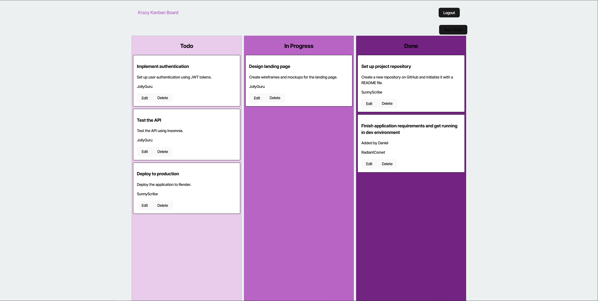

  # My-KanBan

  ## Description

  This is a basic 3 stage KanBan board connected to a database and utilizing JWT tokens and user login for authentication. To-Dos, In Progess, and Completed tickets can be added and read by logged in users to collab.

  # Table of Contents
  1. [Description](#description)
  2. [Installation](#installation)
  3. [Usage](#usage)
  4. [License](#license)
  5. [Contributing](#contributing)
  6. [Tests](#tests)
  7. [Questions](#questions)

  ## Installation

  This is deployed online and requires no installation

  ## Usage

  Having access to a user login, login on the appropriate page and then begin editing the tickets

You can visit the website here:  
  [VISIT HERE!!!](https://my-kanban-hd6b.onrender.com/)

  

  ## License

  This project uses the [MIT License](https://opensource.org/licenses/MIT) license. Click the link to learn more.

  ## Contributing

  Personal project, emails are open to ideas, but not partners contributing to this as a project.

  ## Tests

  If you have a login, go to the deployed page, login, then begin editing. There should be the ability to edit and delete existing tickets. When creating a ticket you should be able to add which category it should go in, it's general contents, a note, and an assigned user.

  ## Questions

  My GitHub:

  [BlazeEMP](https://www.github.com/BlazeEMP)

  My E-mail:

  BlazeLitAnui@gmail.com

  To reach me with further questions, email me here